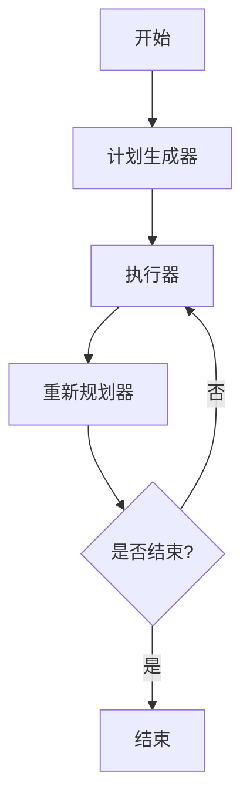

# LangChain 计划执行智能体

一个基于 LangChain 和 LangGraph 构建的智能规划执行系统，能够自动分解复杂任务、制定执行计划，并根据结果动态调整策略。

## 🚀 功能特性

- **智能任务规划**: 自动将复杂查询分解为可执行步骤
- **动态重新规划**: 根据中间结果调整执行策略
- **网络搜索集成**: 使用 Tavily 搜索获取实时信息
- **错误处理**: 强大的错误恢复和降级机制
- **异步处理**: 使用 async/await 实现高效并发操作
- **可视化工作流**: 生成 Mermaid 图表展示工作流程

## 🛠️ 技术栈

- **LangChain**: 构建 AI 应用的核心框架
- **LangGraph**: 状态图工作流引擎
- **DeepSeek API**: 用于推理和规划的大语言模型
- **Tavily Search**: 信息检索的网络搜索工具
- **Python 3.8+**: 需要 async/await 支持

## 📋 前置条件

运行此应用前，请确保您有：

- Python 3.8 或更高版本
- DeepSeek API 密钥
- Tavily API 密钥（用于搜索功能）

## 🔧 安装

```bash
# 克隆仓库
git clone <repository-url>
cd plan-execute-agent

# 安装依赖
pip install langchain-community langchain-openai langgraph langchain-core
```

## ⚙️ 配置

设置环境变量：

```bash
export DEEPSEEK_API_KEY="your-deepseek-api-key"
export TAVILY_API_KEY="your-tavily-api-key"
export LANGCHAIN_TRACING_V2="false"  # 禁用 LangSmith 追踪
```

## 🏗️ 架构设计



### 核心组件

| 组件 | 功能 | 输入 | 输出 |
|------|------|------|------|
| **计划生成器** | 将复杂任务分解为步骤 | 用户查询 | 步骤列表 |
| **执行器** | 执行单个计划步骤 | 当前步骤 | 执行结果 |
| **重新规划器** | 评估进度并决定下一步 | 历史步骤 | 新计划或最终答案 |
| **搜索工具** | 获取实时信息 | 搜索查询 | 搜索结果 |

## 📊 数据结构

```python
class PlanExecute(TypedDict):
    input: str                    # 用户输入的任务
    plan: List[str]              # 计划步骤列表
    past_steps: List[Tuple]      # 已完成步骤的历史记录
    response: str                # 最终响应
```

## 🔧 核心功能

### 1. 搜索执行

```python
async def execute_search(query: str) -> str:
    """执行搜索查询并返回结果"""
    try:
        results = search_tool.run(query)
        return str(results)
    except Exception as e:
        return f"搜索失败: {str(e)}"
```

### 2. LLM 任务执行

```python
async def execute_with_llm(task: str) -> str:
    """使用 LLM 执行任务，结合搜索结果"""
    # 1. 执行搜索获取信息
    search_results = await execute_search(f"搜索关于: {task}")
    
    # 2. 使用 LLM 分析结果
    response = await llm.ainvoke(analysis_prompt)
    return response.content
```

### 3. 计划生成

```python
planner_prompt = ChatPromptTemplate.from_messages([
    ("system", "你是一个计划助手。为给定的目标创建一个简单的逐步计划..."),
    ("user", "{input}")
])

planner = planner_prompt | llm | plan_parser
```

### 4. 重新规划

```python
replanner_prompt = ChatPromptTemplate.from_template("""
基于原始目标、原始计划和已完成的步骤，决定下一步要做什么。

返回 JSON 格式：
- action_type: "response" | "plan"
- content: 最终答案或剩余步骤
""")
```

## 🚀 使用方法

### 基本使用

```python
import asyncio

async def main():
    # 创建工作流
    workflow = StateGraph(PlanExecute)
    
    # 添加节点
    workflow.add_node("planner", plan_step)
    workflow.add_node("agent", execute_step)
    workflow.add_node("replan", replan_step)
    
    # 设置边
    workflow.add_edge(START, "planner")
    workflow.add_edge("planner", "agent")
    workflow.add_edge("agent", "replan")
    workflow.add_conditional_edges("replan", should_end)
    
    # 编译并运行
    app = workflow.compile()
    
    inputs = {
        "input": "2024年巴黎奥运会100米自由泳决赛冠军的家乡是哪里?",
        "past_steps": []
    }
    
    async for event in app.astream(inputs, config={"recursion_limit": 50}):
        for k, v in event.items():
            if k != "__end__":
                print(f"节点 {k}: {v}")

# 运行
asyncio.run(main())
```

### 输出示例

```
节点 planner: {'plan': ['搜索2024年巴黎奥运会100米自由泳决赛冠军', '查找冠军的个人信息', '确定冠军的家乡']}
节点 agent: {'past_steps': [('搜索2024年巴黎奥运会100米自由泳决赛冠军', '找到冠军是潘展乐')]}
节点 replan: {'plan': ['查找潘展乐的个人信息和家乡']}
节点 agent: {'past_steps': [('查找潘展乐的个人信息和家乡', '潘展乐来自浙江温州')]}
节点 replan: {'response': '2024年巴黎奥运会100米自由泳决赛冠军潘展乐的家乡是浙江温州。'}
```

## 🎯 适用场景

- ✅ 需要多步推理的复杂问题
- ✅ 需要实时信息检索的任务
- ✅ 需要动态调整执行策略的场景
- ✅ 知识密集型问答系统
- ✅ 研究和分析任务

## 📈 性能优化

### 建议的优化方向

- **缓存机制**: 实现搜索结果缓存
- **并行执行**: 支持并行任务执行
- **智能路由**: 根据任务类型选择最优执行路径
- **结果验证**: 添加结果验证和质量评估

### 监控指标

```python
# 性能指标
- 任务完成时间
- LLM 调用次数
- 搜索查询次数
- 成功率
- 错误率
```

## 🔒 安全考虑

- **API 密钥管理**: 使用环境变量存储敏感信息
- **输入验证**: 对用户输入进行清理和验证
- **错误处理**: 避免敏感信息泄露
- **速率限制**: 实现 API 调用频率控制

## 🐛 故障排除

### 常见问题

| 问题 | 原因 | 解决方案 |
|------|------|----------|
| API 密钥错误 | 环境变量未设置 | 检查 `DEEPSEEK_API_KEY` 设置 |
| 搜索失败 | 网络连接问题 | 检查网络连接和 Tavily API |
| JSON 解析错误 | LLM 输出格式不正确 | 检查提示模板和输出解析器 |
| 递归限制 | 任务过于复杂 | 增加 `recursion_limit` 或简化任务 |

### 调试技巧

```python
# 启用详细日志
import logging
logging.basicConfig(level=logging.DEBUG)

# 添加调试输出
print(f"当前状态: {state}")
print(f"执行结果: {result}")
```

## 📝 许可证

本项目采用 MIT 许可证 - 查看 [LICENSE](LICENSE) 文件了解详情。

## 🙏 致谢

- [LangChain](https://github.com/langchain-ai/langchain) - 核心框架
- [LangGraph](https://github.com/langchain-ai/langgraph) - 工作流引擎
- [DeepSeek](https://www.deepseek.com/) - 大语言模型
- [Tavily](https://tavily.com/) - 搜索 API


