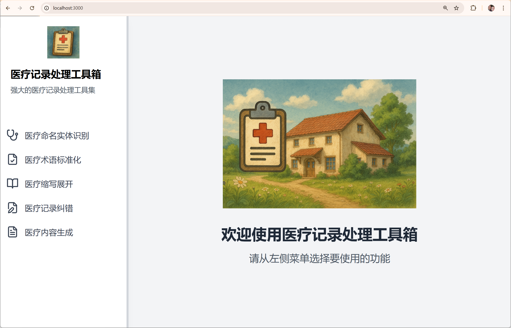

# 医疗网站项目

一个使用 Next.js 和 Tailwind CSS 构建的现代化、响应式医疗网站，提供全面的医疗服务平台。 
<a href="https://u.geekbang.org/subject/airag/1009927"> 极客时间RAG进阶训练营</a>

学习链接： https://u.geekbang.org/subject/airag/1009927 





## 功能特点


## 技术栈

- **前端框架**: Next.js
- **样式**: Tailwind CSS
- **图标**: Heroicons
- **动画**: Framer Motion
- **状态管理**: React Context
- **表单处理**: React Hook Form
- **API 集成**: RESTful APIs

## 开始使用

1. 克隆仓库
2. 安装依赖：
   ```bash
   npm install
   ```
3. 运行开发服务器：
   ```bash
   npm start
   ```
4. 在浏览器中打开 [http://localhost:3000](http://localhost:3000)

## 项目结构

```
medical-website/
├── app/
│   ├── layout.tsx
│   ├── page.tsx
│   └── globals.css
├── components/
│   ├── layout/
│   │   ├── Header.tsx
│   │   ├── Footer.tsx
│   │   └── Navigation.tsx
│   ├── home/
│   │   ├── HeroSection.tsx
│   │   ├── ServiceCategories.tsx
│   │   ├── FeaturedServices.tsx
│   │   ├── WhyChooseUs.tsx
│   │   ├── DoctorProfiles.tsx
│   │   ├── Testimonials.tsx
│   │   └── NewsSection.tsx
│   └── ui/
│       ├── Button.tsx
│       ├── Card.tsx
│       └── Icons.tsx
├── public/
│   └── images/
├── styles/
│   └── globals.css
└── package.json
```

## 参与贡献

1. Fork 本仓库
2. 创建您的特性分支 (`git checkout -b feature/AmazingFeature`)
3. 提交您的更改 (`git commit -m '添加一些特性'`)
4. 推送到分支 (`git push origin feature/AmazingFeature`)
5. 开启一个 Pull Request

## 许可证

本项目采用 MIT 许可证 - 查看 LICENSE 文件了解详情